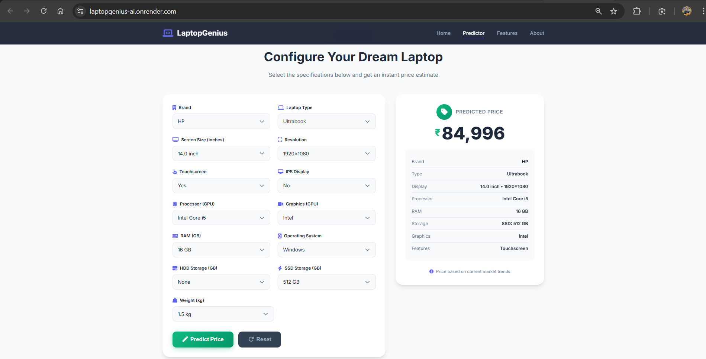

# 💻 LaptopGenius - AI-Powered Laptop Price Predictor

<p align="center">
  
  
  
  
  
</p>

<p align="center">
  <b>An end-to-end Machine Learning project that predicts laptop prices based on hardware specifications using ensemble learning techniques.</b>
</p>

<p align="center">
  🌐 <a href="https://laptopgenius-ai.onrender.com/" target="_blank"><b>Live Demo: https://laptopgenius-ai.onrender.com</b></a>
</p>

---

## 📌 About The Project

**LaptopGenius** is a comprehensive machine learning solution designed to predict laptop prices in the Indian market based on various hardware configurations. This project demonstrates the complete ML lifecycle — from data collection and preprocessing to model deployment with a modern web interface.

> 📝 **Note:** This is a personal project developed to showcase my skills in Data Science, Machine Learning, and Full-Stack Development. The enterprise-grade UI is designed to demonstrate production-ready application development capabilities.

### 🎯 Problem Statement

In the dynamic laptop market, prices vary significantly based on specifications like processor, RAM, storage, display, and brand. This project aims to help consumers and retailers estimate fair market prices for any laptop configuration using machine learning.

---

## ✨ Key Features

| Feature | Description |
|---------|-------------|
| 🤖 **ML-Powered Predictions** | Ensemble model combining Random Forest, Gradient Boosting, and Ridge Regression |
| 📊 **Data-Driven Insights** | Trained on 1,300+ laptop configurations from the Indian market |
| 🌐 **RESTful API** | FastAPI backend with automatic OpenAPI documentation |
| 🎨 **Modern Web Interface** | Responsive, user-friendly UI with real-time predictions |
| 📱 **Mobile-First Design** | Fully responsive across all device sizes |
| ⚡ **Real-Time Results** | Instant price predictions with animated display |

---

## 🛠️ Tech Stack

### Data Science & Machine Learning
- **Python 3.11** - Core programming language
- **Pandas & NumPy** - Data manipulation and numerical computing
- **Scikit-Learn** - ML model development and preprocessing
- **XGBoost** - Gradient boosting implementation
- **Matplotlib & Seaborn** - Data visualization

### Backend
- **FastAPI** - High-performance async API framework
- **Uvicorn** - ASGI server for production deployment
- **Pydantic** - Data validation and serialization

### Frontend
- **HTML5 & CSS3** - Modern semantic markup and styling
- **JavaScript (ES6+)** - Client-side interactivity
- **Font Awesome** - Icon library
- **Google Fonts (Inter)** - Typography

### Development Tools
- **Jupyter Notebook** - Exploratory data analysis
- **Pickle** - Model serialization
- **Git** - Version control

---

## 🏗️ Project Architecture

```
📂 LaptopGenius/
│
├── 📊 artifacts/                     # Data & Model Artifacts
│   ├── laptop_data.csv               # Raw dataset (1,300+ records)
│   ├── df.pkl                        # Preprocessed feature dataframe
│   └── pipe.pkl                      # Trained ML pipeline
│
├── 📓 notebooks/                     # Development & Analysis
│   ├── laptop-price-predictor.ipynb  # EDA, Feature Engineering, Model Training
│   └── main.py                       # Streamlit app (alternative UI)
│
├── 🎨 frontend/                      # Web Interface
│   ├── index.html                    # Main HTML page
│   ├── css/
│   │   └── style.css                 # Modern styling (CSS3)
│   └── js/
│       └── script.js                 # API integration & UI logic
│
├── ⚙️ app.py                         # FastAPI Backend
│   ├── /api/options                  # GET - Dropdown options
│   ├── /api/predict                  # POST - Price prediction
│   └── /api/health                   # GET - Health check
│
├── 📦 Configuration
│   ├── requirements.txt              # Python dependencies
│   ├── Procfile                      # Render deployment
│   └── .python-version               # Python version (3.11)
│
├── 📸 static/                        # Screenshots & Assets
│
└── 📄 README.md                      # Project documentation
```

---

## 🔄 ML Pipeline

```
┌─────────────────────────────────────────────────────────────────────────┐
│                        DATA PREPROCESSING                                │
├─────────────────────────────────────────────────────────────────────────┤
│                                                                          │
│  Raw Data → Feature Extraction → Encoding → Scaling → Feature Selection  │
│                                                                          │
│  • Extract RAM (GB), Weight (kg)                                        │
│  • Parse screen resolution → Calculate PPI                              │
│  • One-Hot Encode: Brand, Type, CPU, GPU, OS                           │
│  • Binary Encode: Touchscreen, IPS Display                              │
│                                                                          │
└─────────────────────────────────────────────────────────────────────────┘
                                    │
                                    ▼
┌─────────────────────────────────────────────────────────────────────────┐
│                         MODEL TRAINING                                   │
├─────────────────────────────────────────────────────────────────────────┤
│                                                                          │
│  ┌──────────────┐  ┌──────────────┐  ┌──────────────┐                  │
│  │   Random     │  │   Gradient   │  │    Ridge     │                  │
│  │   Forest     │  │   Boosting   │  │  Regression  │                  │
│  └──────┬───────┘  └──────┬───────┘  └──────┬───────┘                  │
│         │                  │                 │                          │
│         └──────────────────┼─────────────────┘                          │
│                            ▼                                             │
│                   ┌────────────────┐                                    │
│                   │ Voting/Stacking│                                    │
│                   │   Ensemble     │                                    │
│                   └────────────────┘                                    │
│                                                                          │
└─────────────────────────────────────────────────────────────────────────┘
                                    │
                                    ▼
┌─────────────────────────────────────────────────────────────────────────┐
│                          PREDICTION                                      │
├─────────────────────────────────────────────────────────────────────────┤
│                                                                          │
│  Input Features → Pipeline Transform → Model Predict → exp(log_price)   │
│                                                                          │
│  Output: Predicted Price in INR (₹)                                     │
│                                                                          │
└─────────────────────────────────────────────────────────────────────────┘
```

---


## � Application Screenshots

<p align="center">
  
</p>

<p align="center">
  
</p>

---

## �🚀 Getting Started

### Prerequisites

- Python 3.11 or higher
- pip (Python package manager)
- Git

### Installation

1. **Clone the repository**
   ```bash
   git clone https://github.com/alokchoudhary05/LaptopGenius.ai.git
   cd LaptopGenius.ai
   ```

2. **Create and activate virtual environment**
   ```bash
   # Windows
   python -m venv myenv
   myenv\Scripts\activate

   # Linux/MacOS
   python3 -m venv myenv
   source myenv/bin/activate
   ```

3. **Install dependencies**
   ```bash
   pip install -r requirements.txt
   ```

### Running the Application

#### Option 1: FastAPI Web Application (Recommended)
```bash
# Using uvicorn
uvicorn app:app --reload --host 0.0.0.0 --port 8000

# Or using Python directly
python -m uvicorn app:app --reload --port 8000
```
🌐 Open: **http://localhost:8000**

#### Option 2: Streamlit Application
```bash
streamlit run main.py
```
🌐 Open: **http://localhost:8501**

### API Endpoints

| Method | Endpoint | Description |
|--------|----------|-------------|
| `GET` | `/` | Serve web interface |
| `GET` | `/api/options` | Get dropdown options |
| `POST` | `/api/predict` | Predict laptop price |
| `GET` | `/api/health` | Health check |

#### Sample API Request
```bash
curl -X POST "http://localhost:8000/api/predict" \
  -H "Content-Type: application/json" \
  -d '{
    "company": "Dell",
    "laptop_type": "Notebook",
    "ram": 8,
    "weight": 2.2,
    "touchscreen": "No",
    "ips": "Yes",
    "screen_size": 15.6,
    "resolution": "1920x1080",
    "cpu": "Intel Core i5",
    "hdd": 0,
    "ssd": 256,
    "gpu": "Intel",
    "os": "Windows"
  }'
```

---

## 📊 Dataset Features

| Feature | Type | Description |
|---------|------|-------------|
| Company | Categorical | Laptop brand (Dell, HP, Lenovo, Apple, etc.) |
| TypeName | Categorical | Laptop type (Notebook, Ultrabook, Gaming, etc.) |
| Ram | Numerical | RAM in GB |
| Weight | Numerical | Weight in kg |
| Touchscreen | Binary | Touchscreen support (Yes/No) |
| IPS | Binary | IPS display (Yes/No) |
| PPI | Numerical | Pixels per inch (calculated) |
| CPU brand | Categorical | Processor brand |
| HDD | Numerical | HDD storage in GB |
| SSD | Numerical | SSD storage in GB |
| GPU brand | Categorical | Graphics card brand |
| OS | Categorical | Operating system |
| **Price** | **Target** | **Price in INR** |

---

<!-- ## 🔮 Future Enhancements

- [ ] Add model explainability with SHAP values
- [ ] Implement price trend analysis over time
- [ ] Add comparison feature for multiple configurations
- [x] Deploy on cloud (Render) ✅
- [ ] Add user authentication for saved predictions
- [ ] Integrate real-time market data APIs

--- -->

<!-- ## 🤝 Contributing

Contributions are welcome! Please feel free to submit a Pull Request.

1. Fork the repository
2. Create your feature branch (`git checkout -b feature/AmazingFeature`)
3. Commit your changes (`git commit -m 'Add some AmazingFeature'`)
4. Push to the branch (`git push origin feature/AmazingFeature`)
5. Open a Pull Request

--- -->

## 📄 License

This project is licensed under the MIT License - see the [LICENSE](LICENSE) file for details.

---

## 👨‍💻 Author

**Alok Choudhary**

- GitHub: [alokchoudhary05](https://github.com/alokchoudhary05)
- Project: [LaptopGenius.ai](https://github.com/alokchoudhary05/LaptopGenius.ai)

---

<p align="center">
  <b>⭐ If you found this project helpful, please give it a star!</b>
</p>

<p align="center">
  Made with ❤️
</p>
